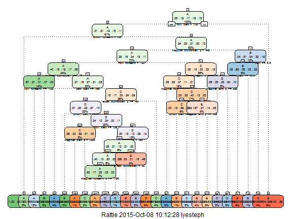

<style type="text/css">
body {
  width: 100%;
  margin: 0;
  padding: 0;
  font-size: 9px;
  background: grey transparent;
}
</style>

## OVERVIEW

The purpose of this project is <font color='Purple'>**build a machine learning algorithm**</font> to predict activity quality from activity monitors.

Using devices such as Jawbone Up, Nike FuelBand, and Fitbit it is now possible to collect a large amount of data about personal activity relatively inexpensively. These type of devices are part of the quantified self movement - a group of enthusiasts who take measurements about themselves regularly to improve their health, to find patterns in their behavior, or because they are tech geeks. One thing that people regularly do is quantify how much of a particular activity they do, but they rarely quantify how well they do it. In this project, your goal will be to use data from accelerometers on the belt, forearm, arm, and dumbell of 6 participants. They were asked to perform barbell lifts correctly and incorrectly in 5 different ways.

<font color='Red'>
Note: The data for this project comes from this source:

http://groupware.les.inf.puc-rio.br/har
</font>

--- .class #id
<font color='Red'>
<b>STEP 1 - INITIAL SETUP AND LOAD LIBRARIES</b>
</font>

```r
# Clear Workspace
rm(list=ls())

# Load Libraries
library(caret)
library(rpart)
library(rpart.plot)
library(rattle)
library(randomForest)
```

--- .class #id
<font color='Red'>
<b>STEP 2 - LOAD DATA</b>
</font>

```r
# Download source data files
SrcURL <- 'https://d396qusza40orc.cloudfront.net/predmachlearn/pml-training.csv'
DestFile <- 'pml-training.csv'
if(!file.exists(DestFile)) {download.file(url = SrcURL, destfile = DestFile, cacheOK = TRUE)}

# Read Data
if(!exists('df_Train')) {df_Train <- read.csv(DestFile, header = TRUE, sep = ',')}
```

Show the number of **Rows** and **Columns** of data

Data Rows = 19,622  
Data Columns = 160

--- .class #id
### Show a <font color='Red'>**Sample**</font> of the data

```r
head(df_Train, 2L)
```

```
##   X user_name raw_timestamp_part_1 raw_timestamp_part_2   cvtd_timestamp
## 1 1  carlitos           1323084231               788290 05/12/2011 11:23
## 2 2  carlitos           1323084231               808298 05/12/2011 11:23
##   new_window num_window roll_belt pitch_belt yaw_belt total_accel_belt
## 1         no         11      1.41       8.07    -94.4                3
## 2         no         11      1.41       8.07    -94.4                3
##   kurtosis_roll_belt kurtosis_picth_belt kurtosis_yaw_belt
## 1                                                         
## 2                                                         
##   skewness_roll_belt skewness_roll_belt.1 skewness_yaw_belt max_roll_belt
## 1                                                                      NA
## 2                                                                      NA
##   max_picth_belt max_yaw_belt min_roll_belt min_pitch_belt min_yaw_belt
## 1             NA                         NA             NA             
## 2             NA                         NA             NA             
##   amplitude_roll_belt amplitude_pitch_belt amplitude_yaw_belt
## 1                  NA                   NA                   
## 2                  NA                   NA                   
##   var_total_accel_belt avg_roll_belt stddev_roll_belt var_roll_belt
## 1                   NA            NA               NA            NA
## 2                   NA            NA               NA            NA
##   avg_pitch_belt stddev_pitch_belt var_pitch_belt avg_yaw_belt
## 1             NA                NA             NA           NA
## 2             NA                NA             NA           NA
##   stddev_yaw_belt var_yaw_belt gyros_belt_x gyros_belt_y gyros_belt_z
## 1              NA           NA         0.00            0        -0.02
## 2              NA           NA         0.02            0        -0.02
##   accel_belt_x accel_belt_y accel_belt_z magnet_belt_x magnet_belt_y
## 1          -21            4           22            -3           599
## 2          -22            4           22            -7           608
##   magnet_belt_z roll_arm pitch_arm yaw_arm total_accel_arm var_accel_arm
## 1          -313     -128      22.5    -161              34            NA
## 2          -311     -128      22.5    -161              34            NA
##   avg_roll_arm stddev_roll_arm var_roll_arm avg_pitch_arm stddev_pitch_arm
## 1           NA              NA           NA            NA               NA
## 2           NA              NA           NA            NA               NA
##   var_pitch_arm avg_yaw_arm stddev_yaw_arm var_yaw_arm gyros_arm_x
## 1            NA          NA             NA          NA        0.00
## 2            NA          NA             NA          NA        0.02
##   gyros_arm_y gyros_arm_z accel_arm_x accel_arm_y accel_arm_z magnet_arm_x
## 1        0.00       -0.02        -288         109        -123         -368
## 2       -0.02       -0.02        -290         110        -125         -369
##   magnet_arm_y magnet_arm_z kurtosis_roll_arm kurtosis_picth_arm
## 1          337          516                                     
## 2          337          513                                     
##   kurtosis_yaw_arm skewness_roll_arm skewness_pitch_arm skewness_yaw_arm
## 1                                                                       
## 2                                                                       
##   max_roll_arm max_picth_arm max_yaw_arm min_roll_arm min_pitch_arm
## 1           NA            NA          NA           NA            NA
## 2           NA            NA          NA           NA            NA
##   min_yaw_arm amplitude_roll_arm amplitude_pitch_arm amplitude_yaw_arm
## 1          NA                 NA                  NA                NA
## 2          NA                 NA                  NA                NA
##   roll_dumbbell pitch_dumbbell yaw_dumbbell kurtosis_roll_dumbbell
## 1      13.05217      -70.49400    -84.87394                       
## 2      13.13074      -70.63751    -84.71065                       
##   kurtosis_picth_dumbbell kurtosis_yaw_dumbbell skewness_roll_dumbbell
## 1                                                                     
## 2                                                                     
##   skewness_pitch_dumbbell skewness_yaw_dumbbell max_roll_dumbbell
## 1                                                              NA
## 2                                                              NA
##   max_picth_dumbbell max_yaw_dumbbell min_roll_dumbbell min_pitch_dumbbell
## 1                 NA                                 NA                 NA
## 2                 NA                                 NA                 NA
##   min_yaw_dumbbell amplitude_roll_dumbbell amplitude_pitch_dumbbell
## 1                                       NA                       NA
## 2                                       NA                       NA
##   amplitude_yaw_dumbbell total_accel_dumbbell var_accel_dumbbell
## 1                                          37                 NA
## 2                                          37                 NA
##   avg_roll_dumbbell stddev_roll_dumbbell var_roll_dumbbell
## 1                NA                   NA                NA
## 2                NA                   NA                NA
##   avg_pitch_dumbbell stddev_pitch_dumbbell var_pitch_dumbbell
## 1                 NA                    NA                 NA
## 2                 NA                    NA                 NA
##   avg_yaw_dumbbell stddev_yaw_dumbbell var_yaw_dumbbell gyros_dumbbell_x
## 1               NA                  NA               NA                0
## 2               NA                  NA               NA                0
##   gyros_dumbbell_y gyros_dumbbell_z accel_dumbbell_x accel_dumbbell_y
## 1            -0.02                0             -234               47
## 2            -0.02                0             -233               47
##   accel_dumbbell_z magnet_dumbbell_x magnet_dumbbell_y magnet_dumbbell_z
## 1             -271              -559               293               -65
## 2             -269              -555               296               -64
##   roll_forearm pitch_forearm yaw_forearm kurtosis_roll_forearm
## 1         28.4         -63.9        -153                      
## 2         28.3         -63.9        -153                      
##   kurtosis_picth_forearm kurtosis_yaw_forearm skewness_roll_forearm
## 1                                                                  
## 2                                                                  
##   skewness_pitch_forearm skewness_yaw_forearm max_roll_forearm
## 1                                                           NA
## 2                                                           NA
##   max_picth_forearm max_yaw_forearm min_roll_forearm min_pitch_forearm
## 1                NA                               NA                NA
## 2                NA                               NA                NA
##   min_yaw_forearm amplitude_roll_forearm amplitude_pitch_forearm
## 1                                     NA                      NA
## 2                                     NA                      NA
##   amplitude_yaw_forearm total_accel_forearm var_accel_forearm
## 1                                        36                NA
## 2                                        36                NA
##   avg_roll_forearm stddev_roll_forearm var_roll_forearm avg_pitch_forearm
## 1               NA                  NA               NA                NA
## 2               NA                  NA               NA                NA
##   stddev_pitch_forearm var_pitch_forearm avg_yaw_forearm
## 1                   NA                NA              NA
## 2                   NA                NA              NA
##   stddev_yaw_forearm var_yaw_forearm gyros_forearm_x gyros_forearm_y
## 1                 NA              NA            0.03               0
## 2                 NA              NA            0.02               0
##   gyros_forearm_z accel_forearm_x accel_forearm_y accel_forearm_z
## 1           -0.02             192             203            -215
## 2           -0.02             192             203            -216
##   magnet_forearm_x magnet_forearm_y magnet_forearm_z classe
## 1              -17              654              476      A
## 2              -18              661              473      A
```

--- .class #id
### Show the <font color='Red'>**column names**</font> of the data

```r
names(df_Train)
```

```
##   [1] "X"                        "user_name"               
##   [3] "raw_timestamp_part_1"     "raw_timestamp_part_2"    
##   [5] "cvtd_timestamp"           "new_window"              
##   [7] "num_window"               "roll_belt"               
##   [9] "pitch_belt"               "yaw_belt"                
##  [11] "total_accel_belt"         "kurtosis_roll_belt"      
##  [13] "kurtosis_picth_belt"      "kurtosis_yaw_belt"       
##  [15] "skewness_roll_belt"       "skewness_roll_belt.1"    
##  [17] "skewness_yaw_belt"        "max_roll_belt"           
##  [19] "max_picth_belt"           "max_yaw_belt"            
##  [21] "min_roll_belt"            "min_pitch_belt"          
##  [23] "min_yaw_belt"             "amplitude_roll_belt"     
##  [25] "amplitude_pitch_belt"     "amplitude_yaw_belt"      
##  [27] "var_total_accel_belt"     "avg_roll_belt"           
##  [29] "stddev_roll_belt"         "var_roll_belt"           
##  [31] "avg_pitch_belt"           "stddev_pitch_belt"       
##  [33] "var_pitch_belt"           "avg_yaw_belt"            
##  [35] "stddev_yaw_belt"          "var_yaw_belt"            
##  [37] "gyros_belt_x"             "gyros_belt_y"            
##  [39] "gyros_belt_z"             "accel_belt_x"            
##  [41] "accel_belt_y"             "accel_belt_z"            
##  [43] "magnet_belt_x"            "magnet_belt_y"           
##  [45] "magnet_belt_z"            "roll_arm"                
##  [47] "pitch_arm"                "yaw_arm"                 
##  [49] "total_accel_arm"          "var_accel_arm"           
##  [51] "avg_roll_arm"             "stddev_roll_arm"         
##  [53] "var_roll_arm"             "avg_pitch_arm"           
##  [55] "stddev_pitch_arm"         "var_pitch_arm"           
##  [57] "avg_yaw_arm"              "stddev_yaw_arm"          
##  [59] "var_yaw_arm"              "gyros_arm_x"             
##  [61] "gyros_arm_y"              "gyros_arm_z"             
##  [63] "accel_arm_x"              "accel_arm_y"             
##  [65] "accel_arm_z"              "magnet_arm_x"            
##  [67] "magnet_arm_y"             "magnet_arm_z"            
##  [69] "kurtosis_roll_arm"        "kurtosis_picth_arm"      
##  [71] "kurtosis_yaw_arm"         "skewness_roll_arm"       
##  [73] "skewness_pitch_arm"       "skewness_yaw_arm"        
##  [75] "max_roll_arm"             "max_picth_arm"           
##  [77] "max_yaw_arm"              "min_roll_arm"            
##  [79] "min_pitch_arm"            "min_yaw_arm"             
##  [81] "amplitude_roll_arm"       "amplitude_pitch_arm"     
##  [83] "amplitude_yaw_arm"        "roll_dumbbell"           
##  [85] "pitch_dumbbell"           "yaw_dumbbell"            
##  [87] "kurtosis_roll_dumbbell"   "kurtosis_picth_dumbbell" 
##  [89] "kurtosis_yaw_dumbbell"    "skewness_roll_dumbbell"  
##  [91] "skewness_pitch_dumbbell"  "skewness_yaw_dumbbell"   
##  [93] "max_roll_dumbbell"        "max_picth_dumbbell"      
##  [95] "max_yaw_dumbbell"         "min_roll_dumbbell"       
##  [97] "min_pitch_dumbbell"       "min_yaw_dumbbell"        
##  [99] "amplitude_roll_dumbbell"  "amplitude_pitch_dumbbell"
## [101] "amplitude_yaw_dumbbell"   "total_accel_dumbbell"    
## [103] "var_accel_dumbbell"       "avg_roll_dumbbell"       
## [105] "stddev_roll_dumbbell"     "var_roll_dumbbell"       
## [107] "avg_pitch_dumbbell"       "stddev_pitch_dumbbell"   
## [109] "var_pitch_dumbbell"       "avg_yaw_dumbbell"        
## [111] "stddev_yaw_dumbbell"      "var_yaw_dumbbell"        
## [113] "gyros_dumbbell_x"         "gyros_dumbbell_y"        
## [115] "gyros_dumbbell_z"         "accel_dumbbell_x"        
## [117] "accel_dumbbell_y"         "accel_dumbbell_z"        
## [119] "magnet_dumbbell_x"        "magnet_dumbbell_y"       
## [121] "magnet_dumbbell_z"        "roll_forearm"            
## [123] "pitch_forearm"            "yaw_forearm"             
## [125] "kurtosis_roll_forearm"    "kurtosis_picth_forearm"  
## [127] "kurtosis_yaw_forearm"     "skewness_roll_forearm"   
## [129] "skewness_pitch_forearm"   "skewness_yaw_forearm"    
## [131] "max_roll_forearm"         "max_picth_forearm"       
## [133] "max_yaw_forearm"          "min_roll_forearm"        
## [135] "min_pitch_forearm"        "min_yaw_forearm"         
## [137] "amplitude_roll_forearm"   "amplitude_pitch_forearm" 
## [139] "amplitude_yaw_forearm"    "total_accel_forearm"     
## [141] "var_accel_forearm"        "avg_roll_forearm"        
## [143] "stddev_roll_forearm"      "var_roll_forearm"        
## [145] "avg_pitch_forearm"        "stddev_pitch_forearm"    
## [147] "var_pitch_forearm"        "avg_yaw_forearm"         
## [149] "stddev_yaw_forearm"       "var_yaw_forearm"         
## [151] "gyros_forearm_x"          "gyros_forearm_y"         
## [153] "gyros_forearm_z"          "accel_forearm_x"         
## [155] "accel_forearm_y"          "accel_forearm_z"         
## [157] "magnet_forearm_x"         "magnet_forearm_y"        
## [159] "magnet_forearm_z"         "classe"
```

--- .class #id
<font color='Red'>
<b>STEP 3 - CLEAN THE DATA</b>
</font>  
Before we start building the models for prediction, we must first clean up the raw data by removing columns that are not required for analysis, removing columns with mostly NA data and removing data with Near Zero Variance (NZV).

<font color='Purple'>
REMOVE UNNECESSARY COLUMNS 1 - 7 AS IT IS NOT MEANINGFUL FOR ANALYSIS
</font>

```r
df_Train <- df_Train[, -c(1:7)]
```

Show the number of **Rows** and **Columns** of data **after removing the unnecessary columns**

Data Rows = 19,622  
Data Columns = 153

--- .class #id
<font color='Purple'>
REMOVE COLUMNS WITH 70% NA VALUES
</font>

```r
Cutoff_Level <- nrow(df_Train) * 0.7
df_Train <- df_Train[, colSums(is.na(df_Train)) <= Cutoff_Level]
```

Show the number of **Rows** and **Columns** of data **after removing the columns with at least 70% of NA values**

Data Rows = 19,622  
Data Columns = 86

<font color='Purple'>
REMOVE COLUMNS WITH NEAR ZERO VARIANCE (NZV)
</font>

```r
Train_NZV <- nearZeroVar(df_Train, saveMetrics = TRUE)
Cols2Keep <- rownames(Train_NZV[Train_NZV$nzv == FALSE, ])
df_Train <- df_Train[Cols2Keep]
```

Show the number of **Rows** and **Columns** of data **after removing the columns with Near Zero Variance (NZV)**

Data Rows = 19,622  
Data Columns = 53

--- .class #id
<font color='Red'>
<b>STEP 4 - SPLIT DATA INTO 2 SETS FOR ANALYSIS</b>
</font>  
After performing the data cleaning, we now split the original data set into 2 - the 1st set is for data sampling and the 2nd set is for cross validation.

<font color='Purple'>
SPLIT THE ORIGINAL DATA SET INTO 2 SEPARATE DATA SETS - ONE WITH 60% OF THE ORIGINAL DATA AND THE OTHER WITH THE REMAINING 40%.
</font>

```r
InclData <- createDataPartition(y = df_Train$classe, p = 0.6, list = FALSE)
df_Train_60 <- df_Train[InclData, ]
df_Train_40 <- df_Train[-InclData, ]
```

<font color='Purple'>
REMOVE ORIGINAL DATA SET AS IT IS NO LONGER REQUIRED
</font>

```r
rm(df_Train)
```

--- .class #id
<font color='Purple'>
<b>DATA SET 1 (60%) - df_Train_60</b>
</font>  
Show the number of **Rows** and **Columns** of data from **Data Set 1 (df_Train_60) which has 60% of the data from the original data set**

Data Rows = 11,776  
Data Columns = 53


<font color='Purple'>
<b>DATA SET 2 (40%) - df_Train_40</b>
</font>  
Show the number of **Rows** and **Columns** of data from **Data Set 2 (df_Train_40) which has 40% of the data from the original data set**

Data Rows = 7,846  
Data Columns = 53

--- .class #id
<font color='Red'>
<b>STEP 5 - PERFORM MACHINE LEARNING ON DECISION TREE</b>
</font>  
After our data sets have been prepared, we now proceed to <font color='Red'>**build the appropriate prediction models using Machine Learning**</font>. We first start with a <font color='Purple'>**Decision Tree**</font> model.


```r
# Set seed
set.seed(1000)

# Use ML Algo for prediction - Decision Tree
PredictionModel1 <- rpart(classe ~ ., data = df_Train_60, method = 'class')

# Perform prediction
DT_Prediction <- predict(PredictionModel1, df_Train_40, type = 'class')
```

--- .class #id
<font color='Red'>
<b>STEP 6 - VIEW DECISION TREE</b>
</font>  
We **view the contents of the Decision Tree** as shown below:-

```r
print(PredictionModel1)
```

```
## n= 11776 
## 
## node), split, n, loss, yval, (yprob)
##       * denotes terminal node
## 
##     1) root 11776 8428 A (0.28 0.19 0.17 0.16 0.18)  
##       2) roll_belt< 130.5 10763 7424 A (0.31 0.21 0.19 0.18 0.11)  
##         4) pitch_forearm< -33.95 936    3 A (1 0.0032 0 0 0) *
##         5) pitch_forearm>=-33.95 9827 7421 A (0.24 0.23 0.21 0.2 0.12)  
##          10) magnet_dumbbell_y< 439.5 8275 5924 A (0.28 0.18 0.24 0.19 0.11)  
##            20) roll_forearm< 122.5 5197 3097 A (0.4 0.18 0.19 0.17 0.062)  
##              40) magnet_dumbbell_z< -27.5 1694  557 A (0.67 0.21 0.014 0.071 0.03)  
##                80) roll_forearm>=-136.5 1405  299 A (0.79 0.17 0.014 0.021 0.0036) *
##                81) roll_forearm< -136.5 289  171 B (0.11 0.41 0.014 0.31 0.16) *
##              41) magnet_dumbbell_z>=-27.5 3503 2540 A (0.27 0.16 0.27 0.21 0.078)  
##                82) yaw_belt>=168.5 475   66 A (0.86 0.076 0.0021 0.059 0.0021) *
##                83) yaw_belt< 168.5 3028 2073 C (0.18 0.17 0.32 0.24 0.09)  
##                 166) accel_dumbbell_y>=-40.5 2605 1897 D (0.21 0.2 0.22 0.27 0.098)  
##                   332) pitch_belt< -43.15 263   31 B (0.0038 0.88 0.061 0.034 0.019) *
##                   333) pitch_belt>=-43.15 2342 1643 D (0.24 0.12 0.24 0.3 0.11)  
##                     666) roll_belt>=125.5 559  228 C (0.36 0.03 0.59 0.014 0.0018)  
##                      1332) magnet_belt_z< -323.5 174    6 A (0.97 0.0057 0.023 0 0.0057) *
##                      1333) magnet_belt_z>=-323.5 385   58 C (0.088 0.042 0.85 0.021 0) *
##                     667) roll_belt< 125.5 1783 1092 D (0.2 0.15 0.13 0.39 0.14)  
##                      1334) yaw_belt< -85.45 1096  823 A (0.25 0.21 0.13 0.21 0.2)  
##                        2668) accel_dumbbell_z< 21.5 655  396 A (0.4 0.13 0.22 0.23 0.023)  
##                          5336) yaw_forearm>=-97.15 493  234 A (0.53 0.17 0.23 0.053 0.024)  
##                           10672) magnet_forearm_z>=-166 330   73 A (0.78 0.14 0.015 0.042 0.027) *
##                           10673) magnet_forearm_z< -166 163   56 C (0.012 0.24 0.66 0.074 0.018) *
##                          5337) yaw_forearm< -97.15 162   38 D (0 0.025 0.19 0.77 0.019) *
##                        2669) accel_dumbbell_z>=21.5 441  240 E (0.032 0.32 0.0068 0.18 0.46)  
##                          5338) roll_dumbbell< 38.61985 149   38 B (0.034 0.74 0.02 0.034 0.17) *
##                          5339) roll_dumbbell>=38.61985 292  116 E (0.031 0.11 0 0.26 0.6) *
##                      1335) yaw_belt>=-85.45 687  227 D (0.11 0.045 0.13 0.67 0.047) *
##                 167) accel_dumbbell_y< -40.5 423   49 C (0.0047 0.035 0.88 0.033 0.043) *
##            21) roll_forearm>=122.5 3078 2068 C (0.082 0.18 0.33 0.23 0.18)  
##              42) accel_forearm_x>=-106.5 2193 1385 C (0.092 0.22 0.37 0.11 0.21)  
##                84) magnet_forearm_z< -245.5 195   41 A (0.79 0.16 0 0.041 0.0051) *
##                85) magnet_forearm_z>=-245.5 1998 1190 C (0.024 0.22 0.4 0.12 0.23)  
##                 170) magnet_dumbbell_y< 262.5 1017  416 C (0.028 0.18 0.59 0.089 0.11)  
##                   340) pitch_belt>=26.15 98    8 B (0.051 0.92 0.031 0 0) *
##                   341) pitch_belt< 26.15 919  321 C (0.025 0.1 0.65 0.099 0.12) *
##                 171) magnet_dumbbell_y>=262.5 981  633 E (0.02 0.27 0.21 0.14 0.35)  
##                   342) magnet_arm_y>=188.5 419  229 B (0.026 0.45 0.31 0.079 0.13) *
##                   343) magnet_arm_y< 188.5 562  269 E (0.016 0.13 0.14 0.19 0.52) *
##              43) accel_forearm_x< -106.5 885  411 D (0.055 0.082 0.23 0.54 0.098)  
##                86) magnet_arm_y>=288.5 275  113 C (0.047 0.11 0.59 0.19 0.069) *
##                87) magnet_arm_y< 288.5 610  188 D (0.059 0.072 0.066 0.69 0.11) *
##          11) magnet_dumbbell_y>=439.5 1552  754 B (0.035 0.51 0.042 0.22 0.19)  
##            22) total_accel_dumbbell>=5.5 1117  390 B (0.049 0.65 0.057 0.019 0.22)  
##              44) roll_belt>=-0.6 941  214 B (0.058 0.77 0.068 0.022 0.079) *
##              45) roll_belt< -0.6 176    0 E (0 0 0 0 1) *
##            23) total_accel_dumbbell< 5.5 435  111 D (0 0.16 0.0023 0.74 0.09) *
##       3) roll_belt>=130.5 1013    9 E (0.0089 0 0 0 0.99) *
```

--- .class #id
<font color='Red'>
<b>STEP 7 - VISUALISE DECISION TREE</b>
</font>  
We **visualise the Decision Tree** by the plot below:-

```r
fancyRpartPlot(PredictionModel1, cex = .5, under.cex = 1, shadow.offset = 0)
```

 

--- .class #id
<font color='Red'>
<b>STEP 8 - SHOW DECISION TREE RESULTS</b>
</font>  
We now show the results of the <font color='Red'>**Decision Tree**</font> prediction model by using the <font color='Purple'>**Confusion Matrix**</font>.


```r
Results <- confusionMatrix(DT_Prediction, df_Train_40$classe)
Results
```

--- .class #id

```
## Confusion Matrix and Statistics
## 
##           Reference
## Prediction    A    B    C    D    E
##          A 1998  246   22   58   19
##          B   69  940  160  121  148
##          C   48  166 1047  116  124
##          D   92   94   92  842  116
##          E   25   72   47  149 1035
## 
## Overall Statistics
##                                           
##                Accuracy : 0.7471          
##                  95% CI : (0.7374, 0.7567)
##     No Information Rate : 0.2845          
##     P-Value [Acc > NIR] : < 2.2e-16       
##                                           
##                   Kappa : 0.6796          
##  Mcnemar's Test P-Value : < 2.2e-16       
## 
## Statistics by Class:
## 
##                      Class: A Class: B Class: C Class: D Class: E
## Sensitivity            0.8952   0.6192   0.7654   0.6547   0.7178
## Specificity            0.9385   0.9213   0.9299   0.9399   0.9542
## Pos Pred Value         0.8528   0.6537   0.6975   0.6812   0.7794
## Neg Pred Value         0.9575   0.9098   0.9494   0.9328   0.9376
## Prevalence             0.2845   0.1935   0.1744   0.1639   0.1838
## Detection Rate         0.2547   0.1198   0.1334   0.1073   0.1319
## Detection Prevalence   0.2986   0.1833   0.1913   0.1575   0.1693
## Balanced Accuracy      0.9169   0.7703   0.8476   0.7973   0.8360
```

--- .class #id
<font color='Purple'>
<b>DECISION TREE RESULT</b>
</font>


The result shows that the accuracy of this model is only **0.7471** ie. **74.71%** accurate.

This is <font color='Red'>**not good enough**</font>.

--- .class #id
<font color='Red'>
<b>STEP 9 - PERFORM MACHINE LEARNING ON RANDOM FOREST</b>
</font>  
As the previous prediction model didn't provide us with a high level of accuracy, we will now proceed to <font color='Red'>**build a better prediction model**</font> by using the <font color='Purple'>**Random Forest**</font> method.


```r
# Use ML Algo for prediction - Random Forest
PredictionModel2 <- randomForest(classe ~. , data = df_Train_60)

# Perform prediction
RF_Prediction <- predict(PredictionModel2, df_Train_40, type = 'class')
```

--- .class #id
<font color='Red'>
<b>STEP 10 - SHOW RANDOM FOREST RESULTS</b>
</font>  
We now show the results of the <font color='Red'>**Random Forest**</font> prediction model by using the <font color='Purple'>**Confusion Matrix**</font>.


```r
Results <- confusionMatrix(RF_Prediction, df_Train_40$classe)
Results
```

--- .class #id

```
## Confusion Matrix and Statistics
## 
##           Reference
## Prediction    A    B    C    D    E
##          A 2231    4    0    0    0
##          B    0 1510   15    0    0
##          C    0    4 1351   26    1
##          D    1    0    2 1256    5
##          E    0    0    0    4 1436
## 
## Overall Statistics
##                                           
##                Accuracy : 0.9921          
##                  95% CI : (0.9899, 0.9939)
##     No Information Rate : 0.2845          
##     P-Value [Acc > NIR] : < 2.2e-16       
##                                           
##                   Kappa : 0.99            
##  Mcnemar's Test P-Value : NA              
## 
## Statistics by Class:
## 
##                      Class: A Class: B Class: C Class: D Class: E
## Sensitivity            0.9996   0.9947   0.9876   0.9767   0.9958
## Specificity            0.9993   0.9976   0.9952   0.9988   0.9994
## Pos Pred Value         0.9982   0.9902   0.9776   0.9937   0.9972
## Neg Pred Value         0.9998   0.9987   0.9974   0.9954   0.9991
## Prevalence             0.2845   0.1935   0.1744   0.1639   0.1838
## Detection Rate         0.2843   0.1925   0.1722   0.1601   0.1830
## Detection Prevalence   0.2849   0.1944   0.1761   0.1611   0.1835
## Balanced Accuracy      0.9994   0.9962   0.9914   0.9877   0.9976
```

--- .class #id
<font color='Purple'>
<b>RANDOM FOREST RESULT</b>
</font>


The result shows that the accuracy of this model is **0.9921** ie. **99.21%** accurate.

This is <font color='Green'>**good enough**</font>.

--- .class #id
<font color='Red'>
<b>STEP 11 - SHOW EXPECTED OUT OF SAMPLE ERROR</b>
</font>  
Out of Sample Error is calculated as `1 - Accuracy`.

For the <font color='Green'>**1st Prediction Model**</font> using <font color='Purple'>**Decision Tree**</font>,  
the <font color='Red'>**Accuracy**</font> = **0.7471**  
and the <font color='Red'>**Out of Sample Error**</font> = 1 - 0.7471 = **0.2529**

For the <font color='Green'>**2nd Prediction Model**</font> using <font color='Purple'>**Random Forest**</font>,  
the <font color='Red'>**Accuracy**</font> = **0.9921**  
and the <font color='Red'>**Out of Sample Error**</font> = 1 - 0.9921 = **0.0079**

## CONCLUSION

Based on the results of the **Confusion Matrix** and **Out of Sample Error** on both prediction models, it shows that the <font color='Red'>**Random Forest model is far more accurate and more reliable than the Decision Tree** model</font>.

Since the <font color='Red'>**Random Forest model is the most accurate model**</font> that we can derive thus far and the **Out of Sample Error is very small**, we will use it for Part 2 of the assignment to predict the outcome from a set of Test Data.

--- .class #id
## ASSIGNMENT PART 2

<font color='Red'>
STEP 1 - LOAD TEST DATA
</font>

```r
SrcURL <- 'https://d396qusza40orc.cloudfront.net/predmachlearn/pml-testing.csv'
DestFile <- 'pml-testing.csv'

if(!exists('df_Test')) {df_Test <- read.csv(DestFile, header = TRUE, sep = ',')}
```

Show the number of **Rows** and **Columns** of data

Data Rows = 20  
Data Columns = 160

--- .class #id
<font color='Red'>
STEP 2 - CONVERT TEST DATA TO HAVE THE SAME COLUMNS AS THE TRAINING DATA
</font>

```r
# Remove last column (classe) as it is not required
Cols2Keep <- colnames(df_Train_60[, -ncol(df_Train_60)])
df_Test <- df_Test[Cols2Keep]
```

Show the number of **Rows** and **Columns** of data **after converting the columns in the test data to be the same as the training data**

Data Rows = 20  
Data Columns = 52

--- .class #id
<font color='Red'>
STEP 3 - DEFINE FUNCTION TO GENERATE RESULTS FILES FOR SUBMISSION
</font>

```r
pml_write_files = function(x) {
  n = length(x)
  for(i in 1:n) {
      filename = paste0("./Part2_Results/problem_id_",i,".txt")
      write.table(x[i],file=filename,quote=FALSE,row.names=FALSE,col.names=FALSE)
  }
}
```

--- .class #id
<font color='Red'>
STEP 4 - PERFORM PREDICTION - USE **RANDOM FOREST** MODEL AS IT IS THE BEST
</font>

```r
RF_Prediction_Test <- predict(PredictionModel2, df_Test, type = 'class')
```

<font color='Red'>
STEP 5 - SHOW THE RESULTS OF THE PREDICTION
</font>

```r
RF_Prediction_Test
```

```
##  1  2  3  4  5  6  7  8  9 10 11 12 13 14 15 16 17 18 19 20 
##  B  A  B  A  A  E  D  B  A  A  B  C  B  A  E  E  A  B  B  B 
## Levels: A B C D E
```

<font color='Red'>
STEP 6 - OUTPUT THE RESULTS TO TEXT FILES
</font>

```r
pml_write_files(RF_Prediction_Test)
```

### ~ END ~
